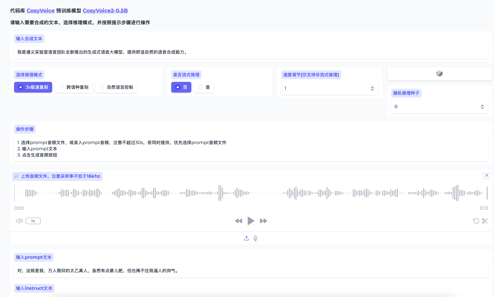

# CosyVoice2
**原仓库地址：** [CosyVoice](https://github.com/FunAudioLLM/CosyVoice?tab=readme-ov-file)

据 CosyVoice 官方的描述，CosyVoice 二代模型比一代模型提供更快，更准，更稳定的语音生成能力。

但是使用起来发现交互方式并没有完全适配 CosyVoice的二代模型，特别不方便，特此我 clone 了官方的源码，做了一些改造。

**改造点主要有：** 

1. 交互方式全部改成只适配 CosyVoice2 模型
2. 优化 UI 交互，提供更清晰的操作 UI
3. 取消生成语音时的流式返回，因为调用api时会有问题

## Demo



## 使用方法
可以参考 CosyVoice 的[官方文档](https://github.com/FunAudioLLM/CosyVoice)
本仓库提供了下载模型的脚本(init.py)，不用自己创建了，因为只支持 CosyVoice2，因此只需要下载这个模型就可以了(可以节省很多磁盘空间)

```shell
# Download the CosyVoice2 model
python init.py
```

下载好模型之后，使用官方提供的 webui.py 脚本启动，这里不需要指定端口和模型，端口默认使用Gradio设置的7860

```shell
# Launch the server
python webui.py
```

